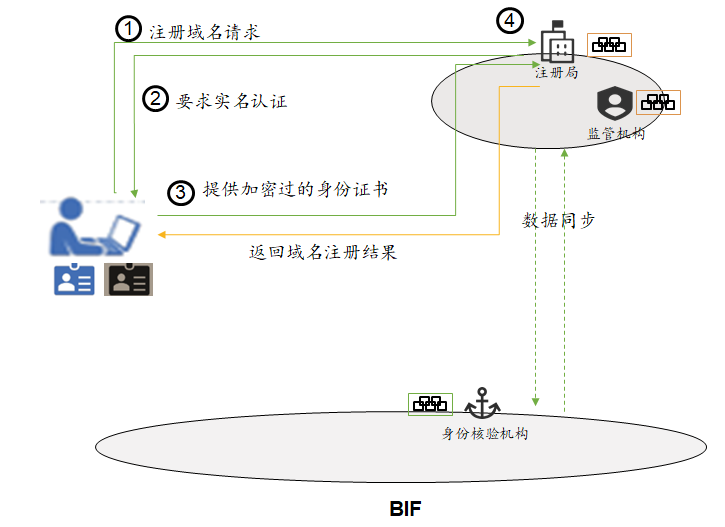
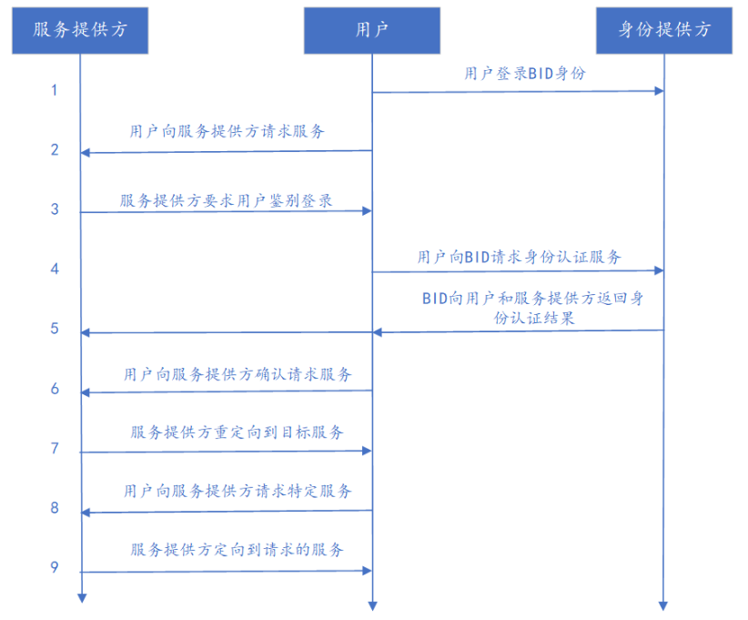

## 1. BID使用场景及解决方案概述

BID为人、组织和物生成分布式标识，通过身份核验机构为实体颁发可信身份凭证，简化身份核验流程，将用户的身份数字化、智能化。

用户或者企业可向BIF链申请BID分布式标识符，向身份核验机构提交身份信息并进行生物信息验证即可获得身份核验机构颁发的身份可信声明，即用户的身份证明。用户可以使用身份证明进行统一登录、实名验证。

通过BID标识和数字身份，企业和个人用户还能更好地进行数据管理和共享，防止数据泄露，保护隐私安全，保证数据安全流通。

## 2. 域名注册中的实名认证

### 2.1 背景

为了保证国家互联网的安全、有序，国家工信部对域名持有者实行实名制审核管理，域名注册全面推行域名实名认证。

实行实名认证之后，能够防止域名被恶意盗取，维护域名的正常应用，减少网络钓鱼、诈骗等情况的出现，提高用户对网站的信任度。总的来说，实名认证对于整个域名行业的发展是有利的。

目前实名认证采取线上提交个人身份证件、企业提交营业执照的方式，有个人、企业数据泄露的风险，且审核时间较长；身份验证数据和域名注册数据不能实时同步到监管机构，造成监管不及时。

### 2.2 参与方

用户

域名注册局

监管机构

### 2.3 基本流程

用户向注册局发送域名注册请求

注册局要求用户实名认证

用户向注册局提供加密过的身份证书

注册局（作为BIF链中的一个节点，有用户的身份数据）验证用户身份证书有效性

注册局根据身份验证结果向用户返回域名结果

### 2.4 效果

将BID实名认证和域名注册结合能带来诸多好处。

**对用户而言：**

• 用户数据所有权回归用户所有，用户隐私数据在一定意义上避免了泄露，验证身份的时候只提供验证结果 

• 用户通过BID能快速完成身份验证，给用户带来便捷的体验

• 一次认证多次使用（用户只需要认证一次，之后证书可以在任何需要场合使用）

**对注册局而言：**

• 开放共享域名注册，提高域名管理透明度 

• 解决顶级域之间域名相关数据共通问题，实现注册局之间数据共享互通 

• 不需要单独提供身份核验服务，也不需要维护用户隐私数据，在一定意义上可以降低成本 

**对监管机构而言：**

• 实现域名的统一治理问题（现在对于人或组织滥用域名等问题。原有系统各自注册局等单位单独维护处理，无法做到全局治理，使用BIF域名管理联盟链可实现域名的统一治理，例如：当有人滥用域名的话，除了对域名有一定的处理之外，还会对于域名的申请者进行特殊监控，达到只要作恶立即处理）

## 3. 统一登录

### 3.1 背景

目前用户在不同平台、不同应用上注册不同的账号密码，繁多的账号密码给用户带来密码疼痛：账号和密码容易遗忘和丢失，造成用户登录不顺畅的问题。

### 3.2 参与方

用户

身份提供方（BID）

服务提供方

### 3.3 流程

用户登录BID身份

用户向服务提供方请求服务

服务提供方要求用户鉴别登录

用户向BID请求身份认证服务

BID向用户和服务提供方返回身份认证结果

用户向服务提供方确认请求服务

服务提供方重定向到目标服务

用户向服务提供方请求特定服务

服务提供方向定向到请求的服务

### 3.4 效果

使用BID进行统一登录，一个ID登录多平台的多种应用，避免了中心化的账户密码管理方式，用户在不泄露用户身份、账号密码信息的同时一键登录多种服务，能够保护用户隐私，提高登录效率，实现安全快速登录。