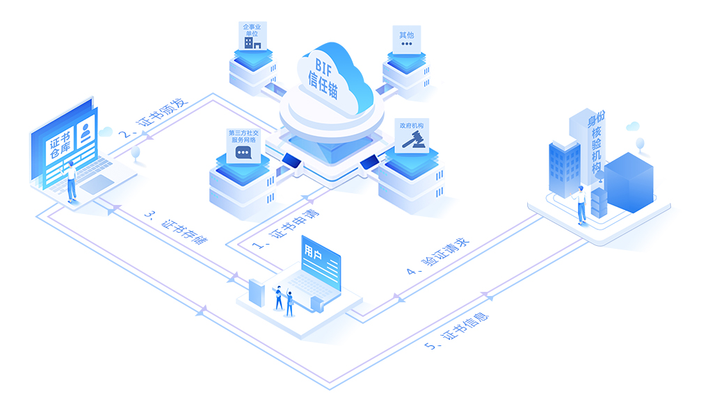
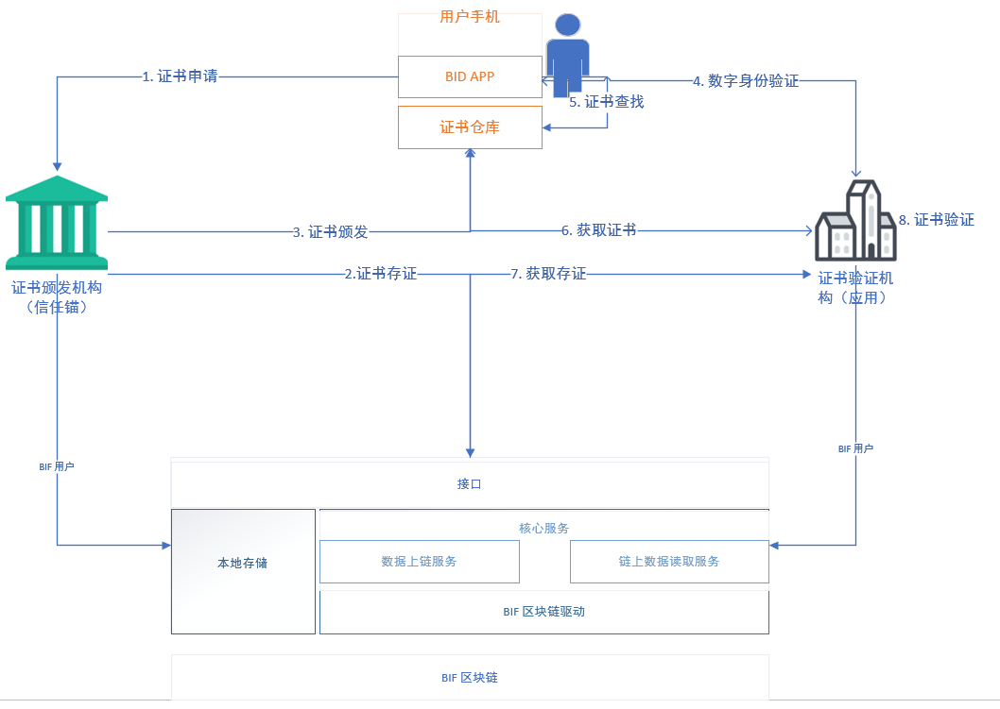

## 1.系统架构

整个架构分为三层：

- BIF 区块链层
- 中间服务层
- BID 应用层

**1.1 BIF区块链层**

BIF区块链是整合架构中的核心、基础，在BIF中实现了bid标识核心协议，其中包括bid标识符协议、多源认证体系管理即多源信任锚管理协议、信任锚激励协议、、多源证书存证管理协议等多个bid相关协议。除此之外BIF保存bid的DDO文档数据。

**1.2 中间服务层**

中间层服务，主要是解决链访问以及链交易TPS问题。另外中间层还包括Teleinfo提供身份信任锚等多个信任锚服务以及支持bid-app所需要的一切服务。

**1.3 BID应用层**

该层表明bid目前已经应用的场景以及后续慢慢要加入的应用场景。

## 2.BID可信认证架构

整个信任系统中主要分为三个角色和一个证书仓库

- 用户
- BIF信任锚
- 证书核验机构（应用）
- 证书仓库

## 3. 主要工作流程

前提：用户，信任锚，证书验证机构均为BIF链上用户，并注册了自己的BID

整个身份认证工作流程如下：

1. 用户向信任锚发出证书（可验证声明）申请
2. 信任锚审核材料并生成证书，将证书存在信息保存在BIF区块链上
3. 将证书颁发给用户，由用户保存在证书仓库中
4. 证书检验机构提供要验证用户的身份用户使用BID登入第三方应用，证书核验机构需要用户提供某可验证声明
5. 用户从证书仓库中搜索证书
6. 将证书可验证信息发送到核验机构
7. 检验机构根据用户提供的信息，从链上读取相应的证书存在
8. 根据存证信息以及用户提供的信息进行身份认证

## 4. BID APP

BID APP 是BID数字身份申请和管理工具，通过BID APP，用户可以申请BID、进行身份认证和证书管理。

详见：[BID APP](../../demo/demo)

## 5. 证书仓库

在BID的生态体系中，需要有一个服务用于保存和管理用户的数据，这就是证书仓库。证书仓库的实现满足几个要求：

- 用户可控。证书仓库可以由用户选择部署于任何地方，包括用户自己的手机、PC等。
- 用户数据加密保存。
- Identity Hub不保存任何私钥。
- 用户数据的访问需要认证。
- 经过用户授权后可允许第三方访问用户数据。

## 6. 证书颁发机构

证书颁发机构即多源认证体系中的认证机构，多源认证不同于以往的单一身份认证体系，BIF可以为实体提供相应的认证源，除此之外用户还可以在第三方可信任的机构进行身份认证。

详见：[多源认证](../authentication)

## 7. BID 解析器

BID 解析器提供的BID的解析服务，能够根据BID 标识查询到对应的DDO 文档内容。

详见：[BID解析器](../resolver)