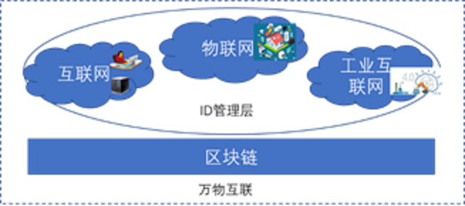
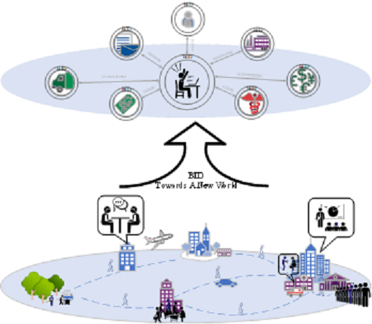

# 1. BID 愿景
BID为实体和数字对象提供统一的去中心化的可信标识/身份服务，可面向区块链与大型网络应用融合的场景，为实现链网协同创新打好基础，最终实现万物互联的智能世界。

BID以用户为中心，让数字智能世界的便捷服务触手可及。

图1  BID构建万物互联泛在网，实现万物互联

图2 BID：Towards A New 

# 2. BID价值
体现在以下三个方面：

 **为万物互联提供统一的标识/身份服务**

* **BID是一种对象标识**，数字世界的每一个实体或数字对象，包括人、组织、物、机器、系统以及各种数字内容都可以用BID来识别。

* **BID采用SSI架构**，符合W3C的DID标准，可基于BID进行跨平台、跨网络的对象信息获取和管理服务。

* **BID可以提供统一的权威的标识身份服务**，基于底层区块链技术，可以在信任网络中实现标识自生成、自我主权管理，同时，采用加密信任验证的去中心化公钥基础设施（DPKI），可以实现可信解析和身份认证。

基于区块链技术,BID以多种信任源形成的信任生态为支撑，为人和物提供多种可验证身份凭证管理，信任源包括各种权威个人身份提供机构和工业互联网备案企业。其中，对于个人用户来说，可以拥有自我主权的数字身份，统一登录各种应用和在支持数字身份的线下场景使用。

 **标识全生命周期管理**

标识的全生命周期管理包括标识的注册、分发、认证、管理、业务与使用。

* 注册：对象提交基本信息，如属性和状态信息、服务端信息等，申请创建BID标识。

* 分发：BID网络为对象创建唯一标识。生成公私钥和对应的验证方法。

* 认证：可基于去中心化公钥基础设施，对BID对象信息进行签名和认证。

* 管理：标识的所有者可以对标识进行管理，如授权访问权限和数据使用权限、身份的授权使用、禁用等。

* 业务与使用：包括标识解析、对象身份凭证从颁发到认证的全生命周期管理等业务。

​                                                    

   图3  标识全生命周期管理

**支持安全可靠的数据管理和价值交互**

BID提供安全可靠的数据存储和传输环境，提供数据加密和隐私数据防泄漏功能。数据所有权归用户所有，数据的访问和传输需要拥有者授权，将数据所有权还给数据产生者，由用户管理自己的数据，实现用户对数据的自我控制和自我管理，避免隐私泄露和数据被盗用。BID还提供数据托管服务，用户可以将数据备份到BID系统中，BID系统会将用户的数据加密存储，避免泄露。

BID系统引入信任锚和激励机制，为实体提供可信身份认证，在此基础上构建可信生态。在可信生态内，人与物、物与物之间可以进行面向数字对象的价值交互。一方面，BID系统为价值交互提供了信用背书，建立安全可信环境，另一方面，BID系统为人与物、物与物之间的价值交互提供平台和接口，接入平台的设备可以方便、快捷地进行交互。